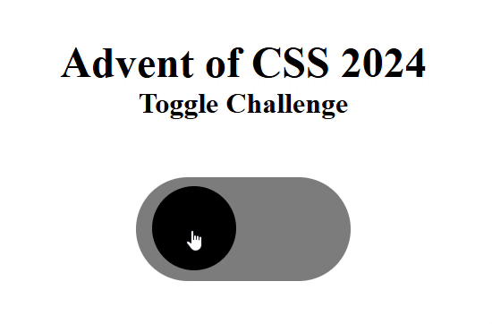

# Advent of CSS 2024

## Challenge 2 - Toggle

Today's challenge is a CSS-only toggle. 

Original challenge site from Amy Dutton [here](https://www.adventofcss.com/).

## Approach/Demo

Vanilla HTML/CSS was used for this challenge.

A final webpage showing the layout for one photo is shown [here](https://myrojoylee.github.io/aoc-2024-challenge-2/).

Demo below rotating between states:

## Notes/Improvements

Transition of the checkmark could be improved. Additionally, accessibility wasn't the focus so that could definitely have been improved.

## Credits

Toggle button setup and transitions were adapted from [Umer Farooq's CodePen](https://codepen.io/Umer_Farooq/pen/eYJgKGN).

## License

Refer to the the license in the repository.
